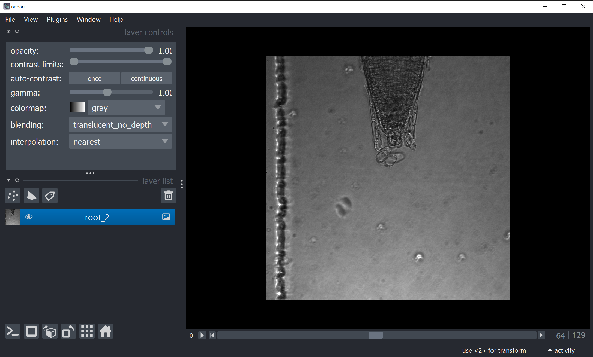
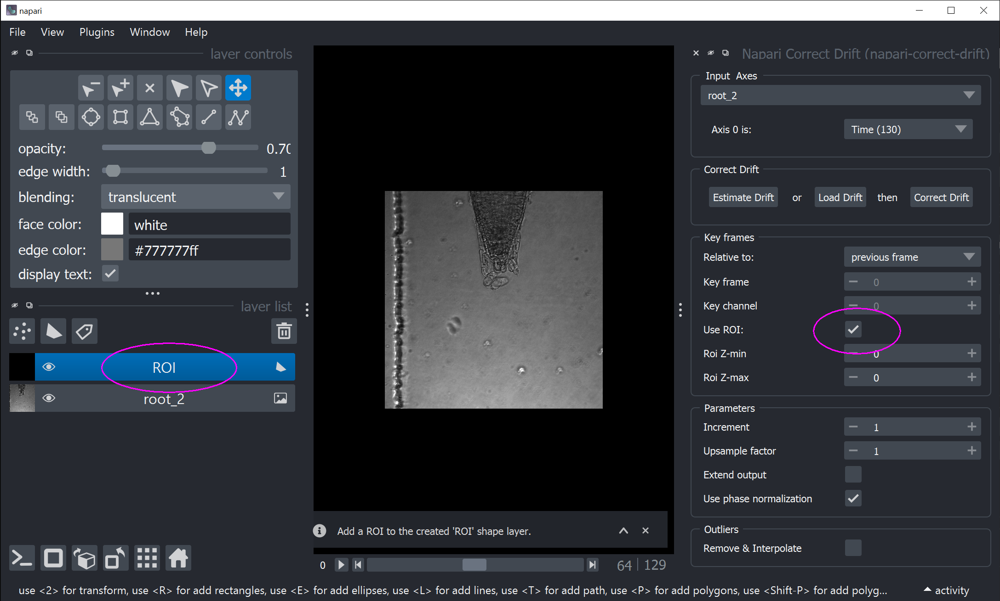
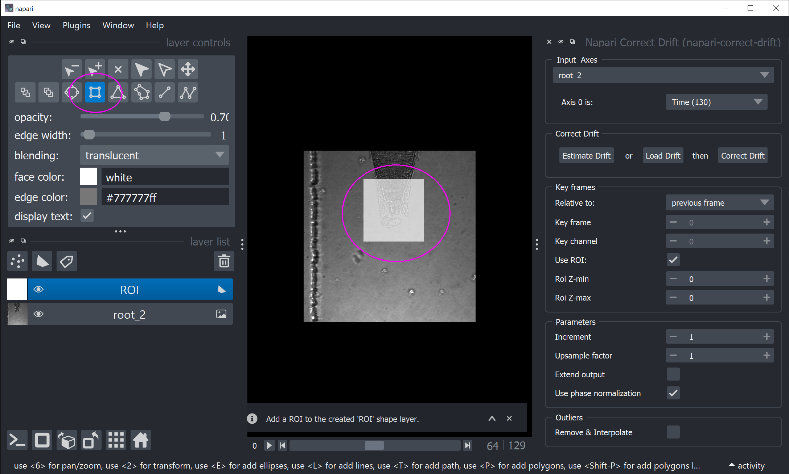

How-to: using ROI
=================

A step-by-step guide on how to use Napari-Correct-Drift on one 2D movie.

The movie shows an growing root tip from vertical microscopy. The object is moviing, while the background is constant. This requires us to use a regions-of-interest (ROI) to focus the correction on the root object. For the rest we will only use default parameters.

0. Download sample movie
------------------------
Click on `root tip <https://seafile.ist.ac.at/f/b05362d4f358430c8c59/?dl=1>`_ and save the `root_2.tif`` file.

1. Open Napari and load movie
-----------------------------
In Napari: `File->Open Files(s)` and select movie

You should see:

2. Open Napari-Correct-Drift plug-in
------------------------------------

In Napari: select `Plugins->Napari Correct Drift (napari-correct-drift)` from menu

3. Check the `Use ROI` checkbox
-------------------------------

In the Napari-Correct-Drift widget on the right, activate the the `Use ROI` checkbox. This will add a new shape layer called **ROI**

4. Draw rectangular ROI over root
---------------------------------

Choose rectangular ROI |roi| and draw onto image

5. Estimate drift
---------------------------------

Estimate drift by clicking the **Estimate drift** button in the Napari-Correct-Drift widget.

This will bring up the drift table widget (lower right) after ~10 seconds.

6. Correct drift
---------------------------------

Correct drift by clicking the **Correct drift** button in the Napari-Correct-Drift widget.

This will add another image shape layer `root_2 (corrected)`

.. image:: _static/ht_a_06.png
  :width: 640
  :alt: Napari with with corrected drift image

Now you can inspect the correction result by using the time slider, i. e. `Axis 0`
