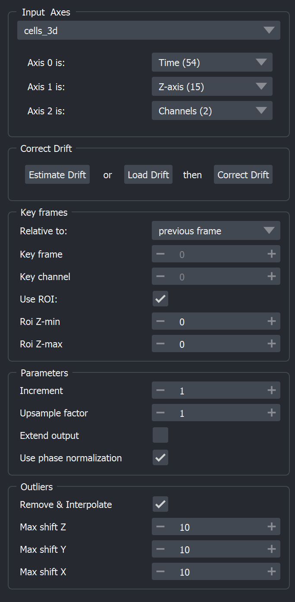

Introduction
============

Main widget
-----------

The main widget is structured in several groups:

The five groups are:

1. `Input Axes`_
2. `Correct Drift`_
3. `Key Frames`_
4. `Parameters`_
5. `Outliers`_

Input Axes
^^^^^^^^^^
Select the Napari layer to process using the drop-down element. Once the layer is selected, make sure the dimensions are correctly set.

When using multidimensional images (with more than 3 dimensions), Napari-Correct-Drift needs to know which dimension corresponds to the *Z*, *Channel* and *Time* dimension. The **Time** dimension always **needs to be assigned**.

Use the drop-down elements per Axis to set *Z*, *Channel* and *Time*. Napari-Correct-Drift displays the size of the selected dimension in brackets.

Correct Drift
^^^^^^^^^^^^^
Run Napari-Correct-Drift using the set parameters. One can **Estimate Drift** or **Load Drift** from a .csv file. Both options will open the Napari-Correct-Drift `Table Widget`_. The table contains the Z,Y,X drifts per time frame.

Select **Correct Drift** to apply the drifts from the table widget to your image data. A new image layer containing the corrected image will be created.

One can follow the progress of the estimation and the correction step in the Napari *notifications* panel.

Key Frames
^^^^^^^^^^
* **Relative to:**
  Choose *previous frame* to estimate drift on consecutive frames or *absolute frame* when using an absolute reference frame:

  Mode for drift estimation:

  1. previous frame: estimate from previous frame. (ROI will move along!)
  2. absolute frame: estimate against absolute frame

* **Key frame:**
  The frame index to use. Note, when computing the drifts relative to *previous frame*, the key frame will be the frame with zero drifts applied. When **Use ROI** is enabled, the value is inferred from the ROI.

* **Key channel:**
  Channel index to use for the drift computation. When **Use ROI** is enabled, the value is inferred from the ROI.

* **Use ROI:**
  When enabled Napari-Correct-Drift expects an ROI in a shape layer named *ROI*. If such a layer is not yet present, it will be automatically created. Add an ROI (e. g. Rectangle shape) at desired channel and key frame.

* **ROI z-min** and **ROI z-max:**
  Minimum and maximum z-slice indecies for 3D-bounding box

Parameters
^^^^^^^^^^
* **Increment**
  Frame increment step for drift estimation. Useful for faster processing and slow drifts. Skipped frames will be linearly interpolated.
* **Upsample factor**
  Subpixel accurate drift estimation. Images will be registered to within 1 / *upsample_factor* of a pixel. Useful for slow drifts.

* **Extend output**
  Correct drifts with extended spatial dimensions. The raw image frames will be fully contained in the output

* **Use phase normalization**
  Phase normalization (recommended) works well in registering images under different illumination . In a high noise scenario, the un-normalized method may be preferable.

Outliers
^^^^^^^^
* **Remove & Interpolate**
  Remove large shifts in consecutive time frames (in mode *previous frame*) and linearly interpolate from other time points.

* **Max shift Z,Y,Z**
  Maximum relative shift allowed in X,Y, or Z. If estimated shift exceeds set value the exceeding shift is removed and linearly interpolated (in pixel).

Table Widget
------------
The Table Widget will display a table of estimated or loaded drifts. It contains 4 columns: frame, Z, Y, X. For 2D images Z will always contain 0.

**Note**, the displayed drifts can be edited by clicking into a cell.

* **Copy to clipboard**
  Copy the drift table to your system clipboard

* **Save as csv**
  Create a comma separated value file (.csv) containing the drift values.
